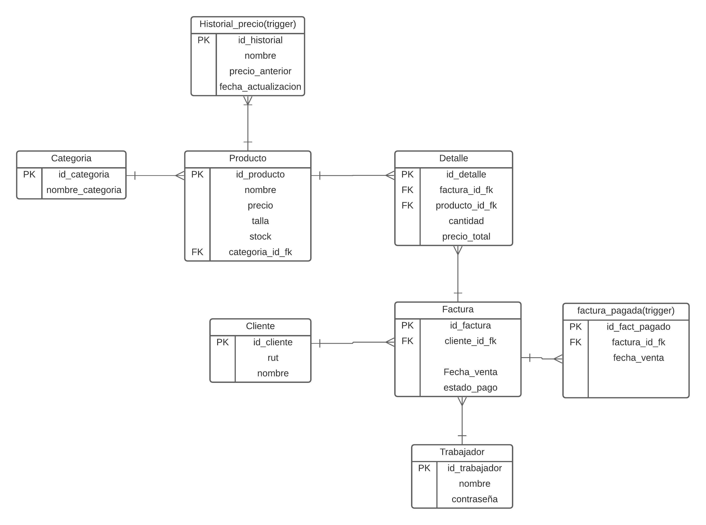

# ZAPATERIA VINTAGE 

## Integrantes: Jose Pino

# PROBLEMATICA:
## El encargado de una tienda de venta  de calzado vintage solicita la creacion de un software el cual le permita  administrar de manera correcta su tienda, nos solicita los siguientes requisitos:

## [] Ingresar Producto
## [] Mostrar los Productos
## [] actualizar el precio de los productos
## [] historial de los precios anteriores  
## [] Vender el Producto
## [] etc...

# ejecutar software:

## imagen 

> modelo 

